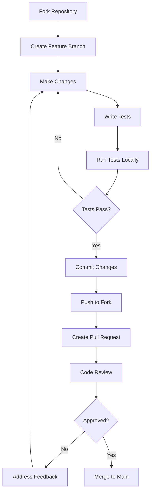

# 🤝 Guia de Contribuição

Obrigado por considerar contribuir para o **PDM-Kotlin**! Este projeto é um recurso educacional e colaborativo para aprender Kotlin e POO.

## 📋 Índice

- [Como Contribuir](#como-contribuir)
- [Tipos de Contribuição](#tipos-de-contribuição)
- [Processo de Desenvolvimento](#processo-de-desenvolvimento)
- [Padrões de Código](#padrões-de-código)
- [Estrutura de Commits](#estrutura-de-commits)
- [Issues e Pull Requests](#issues-e-pull-requests)

## 🚀 Como Contribuir

### 1. Fork e Clone

```bash
# 1. Faça fork do repositório no GitHub

# 2. Clone seu fork
git clone https://github.com/SEU-USERNAME/PDM-Kotlin.git
cd PDM-Kotlin

# 3. Adicione o repositório original como upstream
git remote add upstream https://github.com/ORIGINAL-OWNER/PDM-Kotlin.git
```

### 2. Configuração do Ambiente

```bash
# 1. Verifique os pré-requisitos
java -version  # Deve ser 17+
gradle -version  # Deve ser 8.0+

# 2. Execute os testes
./gradlew build
./test-simple.sh

# 3. Execute o projeto
./gradlew run
```

### 3. Fluxo de Desenvolvimento



## 🎯 Tipos de Contribuição

### 📚 **Educacional**
- ✅ Novos exercícios de Kotlin
- ✅ Melhorias na documentação
- ✅ Exemplos de código adicionais
- ✅ Traduções para outros idiomas

### 🏪 **Sistema SPW**
- ✅ Novas funcionalidades do supermercado
- ✅ Otimizações de performance
- ✅ Questões adicionais (AP3, etc.)
- ✅ Relatórios e análises

### 🔧 **Infraestrutura**
- ✅ Melhorias no build system
- ✅ Automação de testes
- ✅ Scripts de deployment
- ✅ CI/CD pipelines

### 🐛 **Bug Fixes**
- ✅ Correção de erros de compilação
- ✅ Problemas de execução
- ✅ Issues reportados

## 🛠️ Processo de Desenvolvimento

### Branch Strategy

```bash
# Para novas funcionalidades
git checkout -b feature/nome-da-funcionalidade

# Para correções de bugs
git checkout -b bugfix/descricao-do-bug

# Para melhorias na documentação
git checkout -b docs/tipo-de-melhoria

# Para refatoração
git checkout -b refactor/area-refatorada
```

### Exemplo de Workflow

```bash
# 1. Sincronizar com upstream
git fetch upstream
git checkout develop
git merge upstream/develop

# 2. Criar branch para sua contribuição
git checkout -b feature/nova-questao-spw

# 3. Fazer suas alterações
# ... editar arquivos ...

# 4. Testar localmente
./gradlew build
./test-simple.sh

# 5. Commit seguindo padrões
git add .
git commit -m "feat: add AP3Questao1 for advanced inventory analysis"

# 6. Push para seu fork
git push origin feature/nova-questao-spw

# 7. Criar Pull Request no GitHub
```

## 📝 Padrões de Código

### Estilo Kotlin

```kotlin
// ✅ BOM - Seguir convenções Kotlin
class MinhaClasse {
    private val propriedade: String = "valor"
    
    fun minhaFuncao(): String {
        return propriedade.uppercase()
    }
}

// ❌ RUIM - Não seguir convenções
class minhaclasse {
    public var prop = "valor"
    
    fun MINHA_FUNCAO() : String {
        return prop.toUpperCase()
    }
}
```

### Documentação

```kotlin
/**
 * Representa um item de produto no supermercado.
 * 
 * @param codigo Código único do item (código de barras)
 * @param produto Referência para o produto base
 * @param validade Data de validade do item
 */
class ItemProduto(
    private val codigo: Long,
    private val produto: Produto,
    private val validade: Data
) {
    /**
     * Verifica se o item está dentro da validade.
     * 
     * @return true se válido, false se vencido
     */
    fun valido(): Boolean {
        return validade.depois(Data.dataHoje())
    }
}
```

### Estrutura de Arquivos

```
src/main/kotlin/
├── exercicios/          # Exercícios básicos
│   ├── NomeExercicio.kt # PascalCase para classes
│   └── ...
├── supermercado/        # Sistema SPW
│   ├── ClasesBase.kt    # Classes do domínio
│   └── ...
├── questoes/            # Questões AP2/AF
│   ├── AP2Questao*.kt   # Numeração sequencial
│   ├── AFQuestao*.kt    # Padrão consistente
│   └── ...
└── Main.kt              # Menu principal
```

## 🔍 Estrutura de Commits

Usamos [Conventional Commits](https://www.conventionalcommits.org/) para padronizar os commits:

### Formato
```
<type>(<scope>): <description>

[optional body]

[optional footer(s)]
```

### Tipos Permitidos

| Tipo | Descrição | Exemplo |
|------|-----------|---------|
| `feat` | Nova funcionalidade | `feat(spw): add AP3Questao1 for inventory analysis` |
| `fix` | Correção de bug | `fix(estoque): resolve null pointer in getItens()` |
| `docs` | Documentação | `docs(readme): add mermaid diagrams` |
| `style` | Formatação de código | `style(kotlin): apply ktlint formatting` |
| `refactor` | Refatoração | `refactor(genero): simplify class hierarchy` |
| `test` | Adição de testes | `test(carrinho): add unit tests for totalAPagar()` |
| `chore` | Tarefas de manutenção | `chore(gradle): update Kotlin to 2.2.0` |

### Exemplos

```bash
# Nova funcionalidade
git commit -m "feat(spw): add financial analysis dashboard"

# Correção de bug
git commit -m "fix(data): resolve date comparison logic"

# Documentação
git commit -m "docs(contributing): add code style guidelines"

# Breaking change
git commit -m "feat(api)!: change ItemProduto constructor signature

BREAKING CHANGE: ItemProduto now requires Data parameter in constructor"
```

## 🔄 Issues e Pull Requests

### 🐛 Reportando Issues

Use os templates disponíveis:

- **Bug Report**: Para reportar erros
- **Feature Request**: Para sugerir novas funcionalidades  
- **Question**: Para tirar dúvidas
- **Documentation**: Para melhorias na documentação

### 📝 Pull Request Checklist

Antes de submeter seu PR, verifique:

- [ ] ✅ Código compila sem erros (`./gradlew build`)
- [ ] ✅ Testes passam (`./test-simple.sh`)
- [ ] ✅ Código segue padrões do projeto
- [ ] ✅ Documentação atualizada (se necessário)
- [ ] ✅ Commit messages seguem Conventional Commits
- [ ] ✅ PR tem título descritivo
- [ ] ✅ Descrição explica o que foi alterado e por quê

### Template de PR

```markdown
## 📋 Descrição
Breve descrição do que foi alterado.

## 🔄 Tipo de Mudança
- [ ] 🐛 Bug fix
- [ ] ✨ Nova funcionalidade
- [ ] 📚 Documentação
- [ ] 🔧 Refatoração
- [ ] ⚡ Performance

## 🧪 Como Testar
1. Execute `./gradlew run`
2. Navegue até a opção X
3. Verifique que Y acontece

## 📋 Checklist
- [ ] Código compila
- [ ] Testes passam
- [ ] Documentação atualizada
- [ ] Segue padrões do projeto
```

## 🌟 Reconhecimento

Todos os contribuidores são reconhecidos:

- 📝 **All Contributors** - Lista automática no README
- 🏆 **Hall of Fame** - Contribuidores destacados
- 📊 **Stats** - Estatísticas de contribuição

## 📞 Dúvidas?

- 💬 **Discussions**: Use GitHub Discussions para dúvidas gerais
- 🐛 **Issues**: Para bugs e feature requests específicos
- 📧 **Email**: Para questões privadas ou urgentes

---

**Obrigado por contribuir! 🙏**

Juntos, tornamos este projeto um recurso ainda melhor para a comunidade de desenvolvedores Kotlin! 🚀