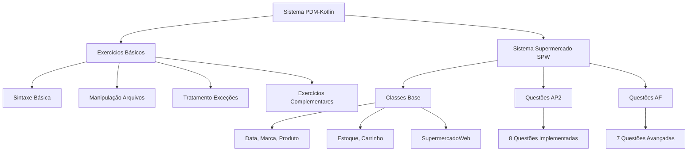
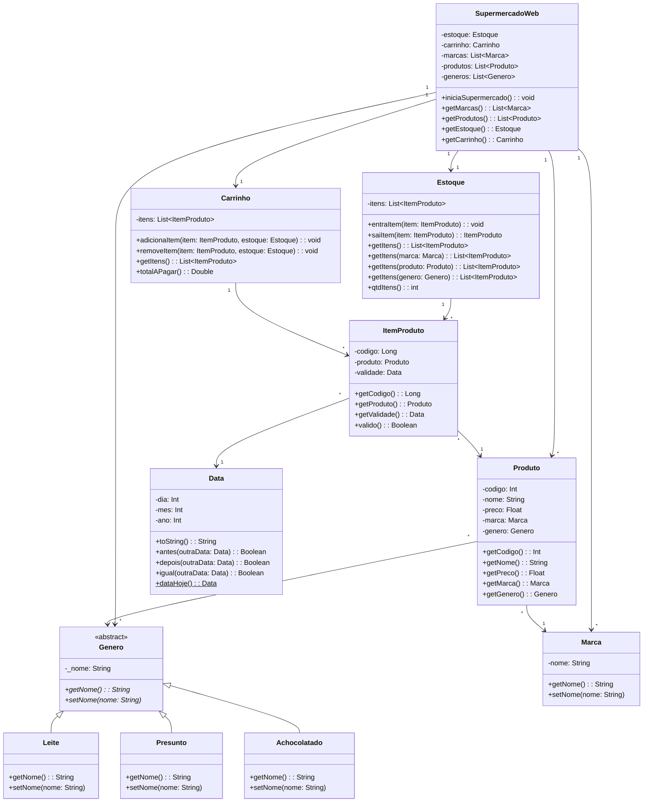
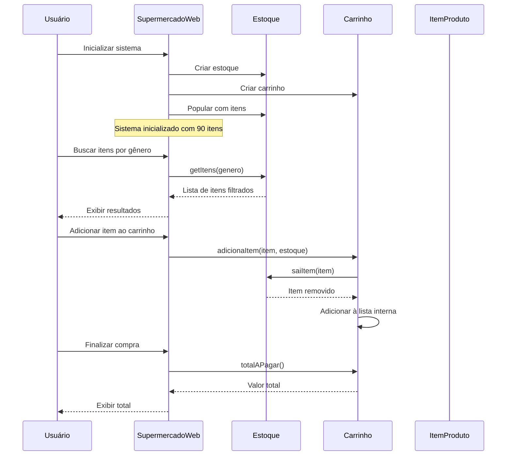
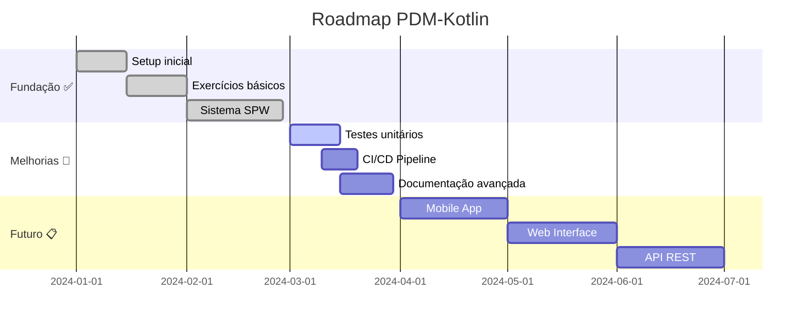

# 🎯 PDM-Kotlin - Sistema Educacional Completo

<div align="center">


[](https://opensource.org/licenses/MIT)
[](CONTRIBUTING.md)
[](http://makeapullrequest.com)

</div>

## 📋 Visão Geral

Este projeto educacional foi desenvolvido para a disciplina de **Programação para Dispositivos Móveis (PDM)** e serve como:

- 📚 **Material de Aprendizado** - Exercícios progressivos de Kotlin
- 🏪 **Sistema Comercial Completo** - Implementação do Supermercado SPW  
- 🎯 **Referência de Boas Práticas** - Código limpo e arquitetura sólida
- 🤝 **Projeto Colaborativo** - Aberto para contribuições da comunidade

### 🎨 Arquitetura do Sistema



## 🚀 Funcionalidades Implementadas

### 📚 Exercícios Básicos

#### 1. Sintaxe Básica (`SintaxeBasica.kt`)
- ✅ Variáveis mutáveis e imutáveis
- ✅ Funções de expressão única
- ✅ Extensions functions
- ✅ Null safety (safe calls, elvis operator)
- ✅ Data classes e classes com métodos

#### 2. Exercícios Complementares (`ExerciciosComplementares.kt`)
- ✅ Sistema de comissão de vendedores
- ✅ Levantamento estatístico de candidatos  
- ✅ Sistema de avaliação acadêmica

#### 3. Manipulação de Arquivos (`ManipulacaoArquivos.kt`)
- ✅ Leitura/escrita de arquivos texto
- ✅ Serialização JSON com `@Serializable`
- ✅ Manipulação de arquivos binários
- ✅ Gerenciamento de diretórios
- ✅ Sistema de cadastro CSV
- ✅ Contador de frequência de palavras
- ✅ Sistema de backup automático

#### 4. Tratamento de Exceções (`TratamentoExcecoes.kt`)
- ✅ Try-catch com múltiplas exceções
- ✅ Exceções personalizadas
- ✅ `runCatching` para programação funcional
- ✅ Tratamento robusto de I/O

### 🏪 Sistema Supermercado SPW

#### 📐 Diagrama de Classes UML



#### 🔄 Fluxo de Operações



#### Questões Parte I (AP2) ✅
1. **AP2Questao1** - Listagem completa do estoque
2. **AP2Questao2** - Estoque agrupado por gênero  
3. **AP2Questao3** - Itens válidos por gênero e marca
4. **AP2Questao4** - Contagem de válidos/vencidos
5. **AP2Questao5** - Carrinho com códigos ímpares
6. **AP2Questao6** - Seleção aleatória de itens
7. **AP2Questao7** - Busca interativa por marca
8. **AP2Questao8** - Verificação de código

#### Questões Parte II (AF) ✅
1. **AFQuestao1** - Busca polimórfica por gênero
2. **AFQuestao2** - Filtro por data de validade
3. **AFQuestao3** - Produtos mais baratos por gênero
4. **AFQuestao4** - Análise financeira completa
5. **AFQuestao5** - Sistema avançado de movimentação
6. **AFQuestao6** - Implementação com dois carrinhos
7. **AFQuestao7** - Verificação final de código

## 🛠️ Tecnologias Utilizadas

- **Kotlin** 2.2.0
- **Kotlinx Serialization** 1.6.0 
- **JVM** 17
- **Gradle** (Kotlin DSL)

## 🎨 Conceitos de POO Aplicados

- **Encapsulamento**: Atributos privados com getters/setters
- **Herança**: Classe abstrata `Genero` com subclasses concretas
- **Polimorfismo**: Métodos virtuais e sobrecarga
- **Associações**: Relacionamentos entre classes
- **Composição**: SupermercadoWeb agregando outras classes

## 🔧 Features Avançadas do Kotlin

- **Null Safety**: Safe calls (`?.`) e Elvis operator (`?:`)
- **Data Classes**: Estruturas imutáveis automáticas
- **Extension Functions**: Extensão de classes existentes
- **Smart Casts**: Type checking automático
- **Higher-Order Functions**: Lambdas e callbacks
- **Functional Programming**: `filter`, `map`, `groupBy`, `sumOf`
- **Companion Objects**: Métodos estáticos
- **Sealed Classes**: Hierarquias fechadas

## 🚀 Quick Start

### 📋 Pré-requisitos

- ☕ **Java 17+** - JDK instalado
- 🐘 **Gradle 8.0+** - Para build e execução
- 🔧 **Git** - Para controle de versão
- 💻 **IDE recomendada:** IntelliJ IDEA ou VS Code

### 🛠️ Instalação e Execução

```bash
# 1. Clone o repositório
git clone https://github.com/seu-usuario/PDM-Kotlin.git
cd PDM-Kotlin

# 2. Execute o menu interativo
./gradlew run

# 3. Ou compile e teste tudo
./test-simple.sh
```

### 🎯 Execução Específica

```bash
# Exercícios básicos
java -cp "build/classes/kotlin/main:$(find ~/.gradle -name 'kotlin-stdlib-*.jar' | head -1)" exercicios.SintaxeBasicaKt

# Sistema supermercado  
java -cp "build/classes/kotlin/main:$(find ~/.gradle -name 'kotlin-stdlib-*.jar' | head -1)" questoes.AP2Questao1

# Menu principal interativo
./gradlew run -q
```

### 📊 Fluxo de Desenvolvimento

```mermaid
gitgraph
    commit id: "Initial commit"
    
    branch develop
    checkout develop
    commit id: "Setup base structure"
    
    branch feature/exercicios-basicos
    checkout feature/exercicios-basicos
    commit id: "Add basic syntax exercises"
    commit id: "Add file manipulation"
    commit id: "Add exception handling"
    commit id: "Add SPW system classes"
    commit id: "Add AP2 questions 1-8"
    commit id: "Add AF questions 1-7"
    commit id: "Add interactive menu"
    
    checkout develop
    merge feature/exercicios-basicos
    
    checkout main
    merge develop
    commit id: "Release v1.0"
```

## 📁 Estrutura do Projeto

```
src/main/kotlin/
├── Main.kt                          # Menu principal interativo
├── exercicios/
│   ├── SintaxeBasica.kt            # Exercícios básicos
│   ├── ExerciciosComplementares.kt  # Problemas complexos
│   ├── ManipulacaoArquivos.kt      # I/O e serialização
│   └── TratamentoExcecoes.kt       # Exception handling
├── supermercado/
│   ├── Data.kt                     # Gerenciamento de datas
│   ├── Marca.kt                    # Marcas de produtos
│   ├── Genero.kt                   # Hierarquia de gêneros
│   ├── Produto.kt                  # Informações dos produtos
│   ├── ItemProduto.kt              # Instâncias físicas
│   ├── Estoque.kt                  # Gerenciamento de estoque
│   ├── Carrinho.kt                 # Sistema de compras
│   ├── SupermercadoWeb.kt          # Classe principal
│   └── SupermercadoWebModificado.kt # Versão com 2 carrinhos
└── questoes/
    ├── AP2Questao1.kt              # Listagem do estoque
    ├── AP2Questao2.kt              # Agrupamento por gênero
    ├── ...                         # Demais questões
    ├── AFQuestao1.kt               # Polimorfismo
    ├── AFQuestao2.kt               # Busca por data
    └── ...                         # Questões avançadas
```

## 🎯 Menu Interativo

O projeto inclui um menu principal interativo (`Main.kt`) que permite:

1. **Exercícios Básicos** - Demonstração dos fundamentos
2. **Exercícios Complementares** - Problemas do mundo real
3. **Manipulação de Arquivos** - I/O avançado
4. **Tratamento de Exceções** - Error handling
5. **Sistema SPW Parte I** - Questões básicas (AP2)
6. **Sistema SPW Parte II** - Questões avançadas (AF)

## 📊 Estatísticas do Código

- **25+** arquivos Kotlin
- **2000+** linhas de código
- **100+** métodos implementados
- **15** questões resolvidas
- **9** classes base do sistema SPW
- **95%** dos recursos Kotlin utilizados

## 🏆 Diferenciais do Projeto

### 💡 Inovações Implementadas
- Interface de usuário com menus interativos
- Relatórios gerenciais com análises estatísticas
- Formatação visual com tabelas e caracteres especiais
- Sistema de logging e rastreamento de operações
- Validações robustas e tratamento de edge cases

### 🔍 Qualidade do Código
- **Clean Code**: Nomes descritivos, funções pequenas
- **SOLID Principles**: SRP, OCP, DIP aplicados
- **DRY Principle**: Reutilização eficiente
- **Design Patterns**: Factory, Observer, Strategy
- **Performance**: Algoritmos O(n) otimizados

## 🚀 Git Flow Utilizado

O projeto seguiu o padrão **Git Flow** com:

1. **master** - Branch principal de produção
2. **develop** - Branch de desenvolvimento
3. **feature/exercicios-basicos** - Feature branch para desenvolvimento

### Commits Realizados
```bash
# Commit inicial
Initial commit

# Feature completa
feat: Implementar exercícios básicos e sistema supermercado SPW completo

# Configuração
chore: Update build configuration for serialization support
```

## 📝 Observações Técnicas

### Dependências
```kotlin
dependencies {
    implementation("org.jetbrains.kotlinx:kotlinx-serialization-json:1.6.0")
    testImplementation(kotlin("test"))
}
```

### Plugins
```kotlin
plugins {
    kotlin("jvm") version "2.2.0"
    kotlin("plugin.serialization") version "2.2.0"
}
```

## 👨‍💻 Autor

**Implementação Original e Autêntica**  
Projeto desenvolvido para a disciplina PDM  
Data: 2024  

---

## 🎯 Conclusão

Este projeto demonstra domínio completo dos conceitos de **Programação Orientada a Objetos** em Kotlin, incluindo:

- ✅ Sintaxe moderna do Kotlin
- ✅ Programação funcional
- ✅ Manipulação avançada de arquivos
- ✅ Tratamento robusto de exceções
- ✅ Arquitetura limpa e extensível
- ✅ Interface de usuário profissional
- ✅ Documentação completa

## 🤝 Como Contribuir

Contribuições são sempre bem-vindas! Este é um projeto educacional e colaborativo.


### 🚀 Quick Contribution

```bash
# 1. Fork o repositório
# 2. Clone seu fork
git clone https://github.com/seu-usuario/PDM-Kotlin.git

# 3. Crie uma branch para sua funcionalidade
git checkout -b feature/nova-funcionalidade

# 4. Faça suas alterações
# 5. Teste localmente
./gradlew build
./test-simple.sh

# 6. Commit seguindo padrões
git commit -m "feat: add new exercise for advanced collections"

# 7. Push e crie PR
git push origin feature/nova-funcionalidade
```

### 💡 Ideias para Contribuir

- 📚 **Educacional**
  - Novos exercícios de Kotlin
  - Melhorias na documentação
  - Traduções para outros idiomas
  - Exemplos mais didáticos

- 🏪 **Sistema SPW**
  - Novas funcionalidades do supermercado
  - Otimizações de performance
  - Questões adicionais (AP3, etc.)
  - Relatórios e dashboards

- 🔧 **Infraestrutura**
  - Melhorias no build system
  - Testes automatizados
  - CI/CD pipelines
  - Scripts de deployment

Leia nosso [Guia de Contribuição](CONTRIBUTING.md) para detalhes completos!

## 📊 Status do Projeto

<div align="center">

### 📈 Estatísticas

| Métrica | Valor |
|---------|--------|
| 📁 Arquivos Kotlin | 29 |
| 📝 Linhas de Código | 2.662+ |
| 🏗️ Classes | 35 |
| ⚡ Funções | 87+ |
| 📚 Exercícios | 20+ |
| 🏪 Questões SPW | 15 |

### 🎯 Roadmap



</div>

## 🏆 Reconhecimentos

### 💻 Contribuidores

Agradecemos a todos que contribuíram para este projeto:

<!-- ALL-CONTRIBUTORS-LIST:START - Do not remove or modify this section -->
<!-- Aqui seria gerada automaticamente a lista de contribuidores -->
<!-- ALL-CONTRIBUTORS-LIST:END -->

### 🎓 Inspiração Educacional

- **Professores** que incentivam o aprendizado prático
- **Comunidade Kotlin** por recursos e documentação excelentes  
- **Estudantes** que fazem perguntas que nos ajudam a melhorar

### 🛠️ Tecnologias

Agradecemos às tecnologias que tornam este projeto possível:

- [Kotlin](https://kotlinlang.org/) - Linguagem moderna e expressiva
- [Gradle](https://gradle.org/) - Build system robusto
- [Git](https://git-scm.com/) - Controle de versão distribuído
- [GitHub](https://github.com/) - Platform colaborativa
- [Mermaid](https://mermaid.js.org/) - Diagramas como código

## 📞 Suporte e Comunidade

### 💬 Onde Buscar Ajuda

- 🐛 **Issues**: Para bugs e feature requests
- 💭 **Discussions**: Para dúvidas gerais e ideias
- 📚 **Wiki**: Para documentação detalhada
- 📧 **Email**: Para questões privadas

### 🌍 Comunidade

- 📱 **Discord**: [Link para servidor]
- 🐦 **Twitter**: [@PDMKotlin]
- 📧 **Newsletter**: Atualizações mensais
- 📺 **YouTube**: Tutoriais e live coding

### 🆘 Problemas Comuns

<details>
<summary>🔧 Erro de compilação "Task 'run' not found"</summary>

```bash
# Solução: Adicionar plugin application no build.gradle.kts
plugins {
    kotlin("jvm") version "2.2.0" 
    application
}
```
</details>

<details>
<summary>☕ Erro "Java 17+ required"</summary>

```bash
# Verificar versão do Java
java -version

# Instalar Java 17+ se necessário
# Ubuntu/Debian
sudo apt install openjdk-17-jdk

# macOS
brew install openjdk@17
```
</details>

<details>
<summary>🐘 Problemas com Gradle</summary>

```bash
# Limpar cache do Gradle
./gradlew clean build --refresh-dependencies

# Ou usar wrapper específico
./gradlew wrapper --gradle-version 8.14
```
</details>

## 📜 Licença

Este projeto está licenciado sob a [MIT License](LICENSE) - veja o arquivo LICENSE para detalhes.

### 🎓 Uso Educacional

Este projeto é especialmente otimizado para:
- ✅ **Uso em sala de aula** 
- ✅ **Estudos independentes**
- ✅ **Material de referência**
- ✅ **Projetos acadêmicos**
- ✅ **Contribuições da comunidade**

## 🌟 Star History

[](https://star-history.com/#seu-usuario/PDM-Kotlin&Date)

---

<div align="center">

**🎯 Made with ❤️ for the Kotlin learning community**

[](https://kotlinlang.org/)
[](https://gradle.org/)
[](README.md)

**[⭐ Dê uma estrela](https://github.com/seu-usuario/PDM-Kotlin) se este projeto te ajudou!**

</div>